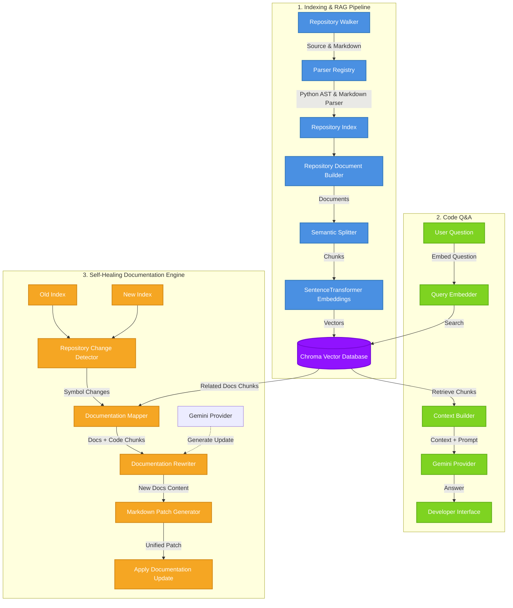

# 🚀 AutoDocs

**AutoDocs** is an AI-powered documentation maintenance assistant that parses, indexes, and queries codebases, keeping developer documentation in sync with code updates automatically. By utilizing Abstract Syntax Tree (AST) parsing, semantic chunking, and Retrieval-Augmented Generation (RAG) powered by Gemini, AutoDocs makes developer documentation live, interactive, and self-healing.

---

## 🌟 Key Features

- 🔍 **Multi-Language Parsing**: Deep parsing of Python AST (Abstract Syntax Trees) to extract modules, classes, functions, signatures, and docstrings, alongside generic Markdown parsing.
- 🧠 **Semantic Code Retrieval (RAG)**: Automatically chunks codebase documents and computes embeddings using SentenceTransformers, enabling semantic querying and contextual Q&A via Google Gemini.
- ⚡ **Chroma Vector Store Integration**: Native indexing and similarity search with ChromaDB.
- 🩺 **Self-Healing Documentation**: Compares different codebase revisions, automatically detects semantic code changes (added, removed, or modified signatures/docstrings), links affected documentation via similarity searches, and applies AI-generated documentation updates (patches).

---

## 🛠️ Architecture

Here is the pipeline architecture of AutoDocs:



---

## 📂 Project Directory Structure

```directory
AutoDocs/
├── src/
│   ├── analyzer/                  # Walks code/docs and builds indices
│   │   ├── repository_index.py    # Holds indices of modules, files, and classes
│   │   └── repository_indexer.py  # Coordinates repo walking & parsing
│   ├── app/
│   │   ├── application_container.py # DI Service Container
│   │   └── bootstrap.py           # Application bootstrapper
│   ├── chunking/                  # Logic for semantic document chunking
│   │   ├── semantic_splitter.py   # Splits documents semantically
│   │   └── repository_chunker.py  # Orchestrates document chunking
│   ├── embeddings/                # Embeddings generation (SentenceTransformers)
│   ├── healing/                   # Self-healing documentation pipeline
│   │   ├── repository_change_detector.py # Detects symbol addition/modification/deletion
│   │   ├── documentation_mapper.py # Maps code symbol changes to docs via RAG
│   │   └── documentation_rewriter.py # Modifies documentation contents using LLMs
│   ├── llm/                       # LLM Provider wrappers (Gemini API)
│   ├── models/                    # Data transfer models (symbols, chunks, documents)
│   ├── parser/                    # Base, Python (AST), and Markdown parsers
│   ├── pipeline/                  # Pipeline document builders
│   ├── qa/                        # Orchestrates Retrieval-Augmented Generation Q&A
│   ├── retrieval/                 # Chroma-based document retrievers and context builders
│   ├── vector_store/              # Chroma Vector DB interface
│   ├── main.py                    # Entry point for testing Repository QA
│   └── demo_healing.py            # Entry point for Self-Healing demo
├── tests/                         # Suite of 75+ unit and integration tests
├── pyproject.toml                 # Pyright/Mypy & pytest configs
├── requirements.txt               # Project dependencies
└── README.md                      # Project documentation
```

---

## ⚙️ Installation & Setup

### Prerequisites

- Python 3.10+
- A Gemini API Key (get one from [Google AI Studio](https://aistudio.google.com/))

### 1. Clone & Set Up Virtual Environment

```bash
git clone <repository-url>
cd AutoDocs
python -m venv .venv
```

Activate the environment:

- **Windows (PowerShell)**:
  ```powershell
  .venv\Scripts\Activate.ps1
  ```
- **Linux/macOS**:
  ```bash
  source .venv/bin/activate
  ```

### 2. Install Dependencies

```bash
pip install -r requirements.txt
```

### 3. Environment Variables

Create a `.env` file in the root directory and add your Google Gemini API Key:

```env
GEMINI_API_KEY=your_gemini_api_key_here
```

---

## 🚀 Usage

AutoDocs comes with out-of-the-box scripts to demonstrate both Code Q&A and Self-Healing capabilities.

### 1. Codebase Q&A (RAG)

Ask questions directly to your codebase. AutoDocs indexes the repository in ChromaDB, retrieves the relevant source chunks, and answers via Gemini.

Run the QA script:
```bash
python src/main.py
```

*Example usage:*
```python
from dotenv import load_dotenv
from app.bootstrap import build_repository_qa

load_dotenv()

# Build QA engine on sample repository
qa = build_repository_qa("sample_repo")

# Ask a semantic question
response = qa.ask("How does login work?")
print(response.answer)
```

### 2. Self-Healing Documentation

Compare two versions of a codebase, automatically detect changed signatures or docstrings, find matching documentation, and generate markdown patches.

Run the Healing demo:
```bash
python src/demo_healing.py
```

*Example workflow:*
```python
from app.bootstrap import build_application, build_autodocs_engine

# Index two versions of the repository
old_container = build_application("sample_repo_v1")
new_container = build_application("sample_repo_v2")

# Initialize Self-Healing Engine
engine = build_autodocs_engine("sample_repo_v2")

# Detect changes and generate markdown documentation patches
patches = engine.heal(
    old_container.repository_index,
    new_container.repository_index,
)

for patch in patches:
    print(patch)
```

---

## 🧪 Testing

AutoDocs has comprehensive test coverage containing 79 tests. To run tests, make sure you are in the virtual environment and execute:

```bash
pytest
```

On Windows with venv activated:
```powershell
.venv\Scripts\pytest
```

---

## 🗺️ Project Roadmap

- [x] Python AST Parsing (classes, signatures, docstrings)
- [x] Semantic document/code chunking
- [x] Chroma Vector DB integration & embedding indexing
- [x] RAG-based context building & codebase Q&A
- [x] Change detection between code revisions
- [x] Semantic mapping of code changes to markdown files
- [x] Self-Healing documentation patch generation
- [ ] Multi-language support (JavaScript/TypeScript AST parser)
- [ ] PR/CI Integration (auto-heal documentation on Git commits)
- [ ] Live UI Web App dashboard for document state visualization